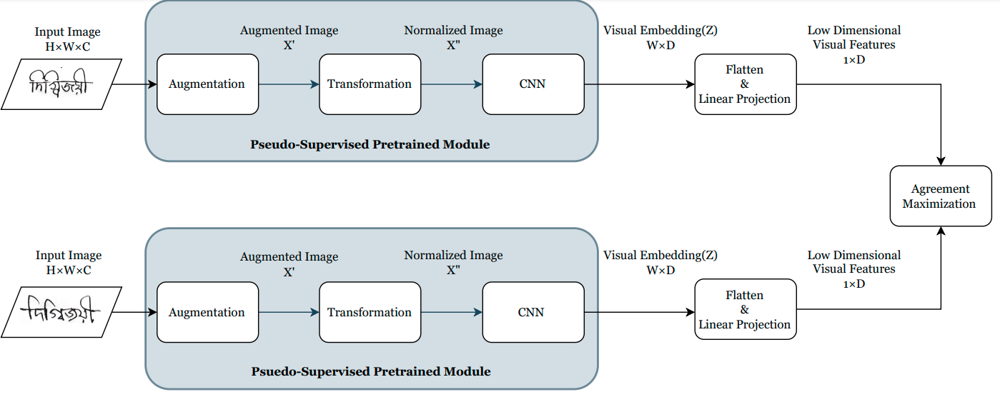

# PyTorch SimCLR For Bengali Text Recognition
<!-- [](https://zenodo.org/badge/latestdoi/241184407) -->


<!-- ### Blog post with full documentation: [Exploring SimCLR: A Simple Framework for Contrastive Learning of Visual Representations](https://sthalles.github.io/simple-self-supervised-learning/) -->




## Installation

```
$ conda env create --name simclr --file env.yml
$ conda activate simclr
$ python run.py
```

## Config file

Before running SimCLR, make sure you choose the correct running configurations. You can change the running configurations by passing keyword arguments to the ```run.py``` file.

```python

$ python run.py --log-every-n-steps 100 --epochs 100 

```

If you want to run it on CPU (for debugging purposes) use the ```--disable-cuda``` option.

For 16-bit precision GPU training, there **NO** need to to install [NVIDIA apex](https://github.com/NVIDIA/apex). Just use the ```--fp16_precision``` flag and this implementation will use [Pytorch built in AMP training](https://pytorch.org/docs/stable/notes/amp_examples.html).
